# Credit_Risk_Analysis

## Overview

This project uses different techniques to train and avaluate models with unblanced classes using credit card dataset.
In this analysis we use the following models for our evaluation:

- Oversampling ( RandomOverSampler and SMOTE algorithms)
- Undersampling ClusterCentroids algorithm)
- Combinational approach(SMOTEENN algorithm)
- Two machine learning models that reduces bias to predit credit risk( BalancedRandomForestClassifier and EasyEnsembleClassifier)

## Result

- **RandomOverSampler Model:**

The accuracy score for this model is 63.75%. The average precision and recall is 99% and 67%. Below is the confusion matrix and classification reports for this model. The precison for high risk is low at 1%, same as f1 score at  2% for this class. That means we have a large number of false positive or large number of low risk creit cards that predicted high risk (5720).The recall for high risk is 61%.

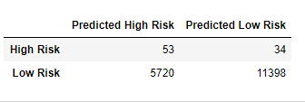

- **SMOTE Oversamling:**

The accuracy for this model is 64.70%.The average precision and recall is 99% and 64%. Below is the confusion matrix and classification reports for this model. The precison for high risk is low at 1%, same as f1 score at 2% for this class. That means we have a large number of false positive or large number of low risk creit cards that predicted high risk (6184).The recall for high risk is 66%.

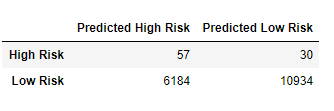

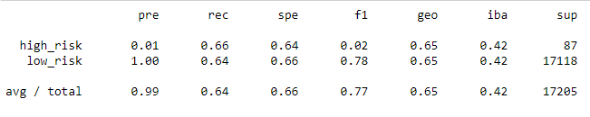

- **Undersampling:**

The accuracy score for this model is 52.96%. The average precision and recall is 99% and 45%. Below is the confusion matrix and classification reports for this model. The precison for high risk is low at 1%, same as f1 score at 1% for this class. That means we have a large number of false positive or large number of low risk creit cards that predicted high risk (9416).The recall for high risk is 61%. 

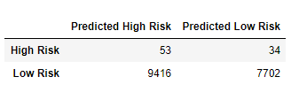

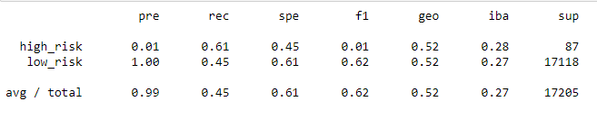

- **Combination (Over and Under) Sampling:**

The accuracy for this model is 64.04%.The average precision and recall is 99% and 58%. Below is the confusion matrix and classification reports for this model. The precison for high risk is low at 1%, same as f1 score at 2% for this class. That means we have a large number of false positive or large number of low risk creit cards that predicted high risk(7194).The recall for high risk is 70%.

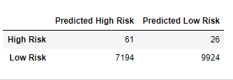

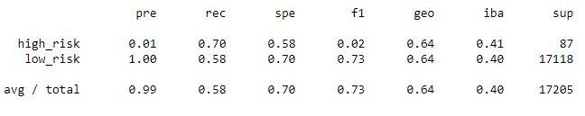

- **Balanced Random Forest Classifier:**

The accuracy for this model is 80.30%.The average precision and recall was 99% and 90%. Below is the confusion matrix and classification reports for this model. The precison for high risk is low at 4%, same as f1 score at 7% for this class. That means we have a large number of false positive or large number of low risk creit cards that predicted high risk (1630).The recall for high risk is 70%.

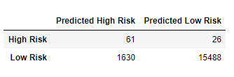

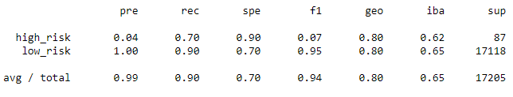

- **Easy Ensemble AdaBoost Classifier:**

The accuracy for this model is 92.54%.The average precision and recall was 99% and 94%. Below is the confusion matrix and classification reports for this model. The precison for high risk is low at 7%, same as f1 score at 14% for this class. That means we have a large number of false positive or large number of low risk creit cards that predicted high risk (979).The recall for high risk is 91%.

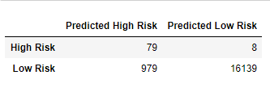

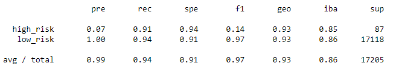

## Summary

For this perticular analysis we are looking for lowers number of False Negative for high risks. In oter words we want to have a lower number of high risk that were predicted as low risk. Having said that, we want to look at higher percentage of recall with a good higher accuracy. Out of all models, The Easy Ensemle AdaBoost has the highest accuracy score at 92.54% and the least false negative for high risk along with the highest recall percentage (%70) for high risk credit cards. 