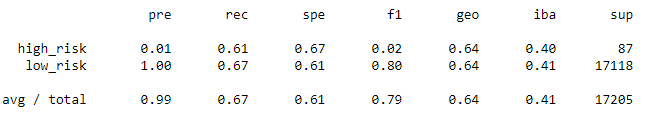
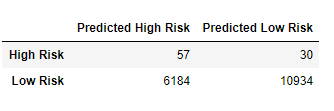
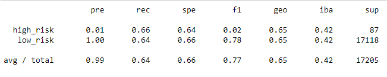
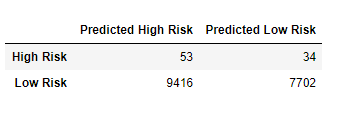
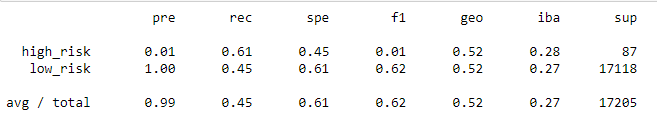
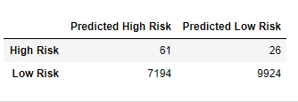
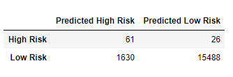
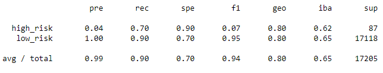
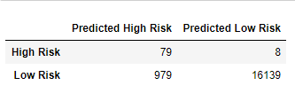
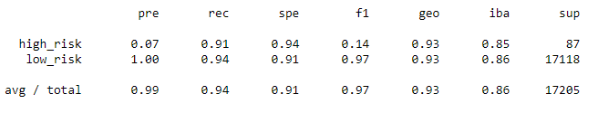

# Credit_Risk_Analysis

## Overview

This project uses different techniques to train and evaluate models with unbalanced classes using credit card dataset.
In this analysis we use the following models for our evaluation:

- Oversampling ( RandomOverSampler and SMOTE algorithms)
- Undersampling ClusterCentroids algorithm)
- Combinational approach(SMOTEENN algorithm)
- Two machine learning models that reduces bias to predit credit risk( BalancedRandomForestClassifier and EasyEnsembleClassifier)

## Result

**RandomOverSampler Model:**

- Balanced Accuracy score: 63.75%
- Precision for high risk: 1%
- Recall for high risk: 61%

The average precision and recall is 99% and 67%. Below is the confusion matrix and classification reports for this model. The f1 score is 79%. The number of false positive or low risk creit cards that predicted high risk  is 5720.

**SMOTE Oversamling:**

- Balanced Accuracy score: 64.70%
- Precision for high risk: 1%
- Recall for high risk: 66%

The average precision and recall is 99% and 64%. Below is the confusion matrix and classification reports for this model. The f1 score at 77% for this class. The number of false positive or low risk creit cards that predicted high risk  is 6184.

**Undersampling:**

- Balanced Accuracy score: 52.96%
- Precision for high risk: 1%
- Recall for high risk: 61%

The average precision and recall is 99% and 45%. Below is the confusion matrix and classification reports for this model. The f1 score is 62% . The number of false positive or low risk creit cards that predicted high risk  is 9416. 

**Combination (Over and Under) Sampling:**

- Balanced Accuracy score: 64.04%
- Precision for high risk: 1%
- Recall for high risk: 70%

The average precision and recall is 99% and 58%. Below is the confusion matrix and classification reports for this model. The f1 score is 73%. The number of false positive or low risk creit cards that predicted high risk  is 7194.

**Balanced Random Forest Classifier:**

- Balanced Accuracy score: 80.30%
- Precision for high risk: 4%
- Recall for high risk: 70%

The average precision and recall was 99% and 90%. Below is the confusion matrix and classification reports for this model. The f1 score is 94% . The number of false positive or low risk creit cards that predicted high risk  is 1630.

**Easy Ensemble AdaBoost Classifier:**

- Balanced Accuracy score: 92.54%
- Precision for high risk: 7%
- Recall for high risk: 91%

The average precision and recall was 99% and 94%. Below is the confusion matrix and classification reports for this model. The f1 score is 97%. The number of false positive or low risk creit cards that predicted high risk  is 979.

## Summary

For this perticular analysis we are looking for lowers number of False Negative on high risk credit cards. In oter words we are looking for a lower number of high risk credit cards that were predicted low risk. Having said that, we need to look at higher percentage of recall for high ris with a good accuracy. Out of all models, The Easy Ensemle AdaBoost has the highest accuracy score at 92.54% and the least false negative for high risk along with the highest recall percentage (%70). From the point of safety , Easy Ensemble model is the one to choose, , however 979 or 6% of low risk credit cards were falsely predicted high risk and that would be lost opporunities for the credit card company or bank.    

